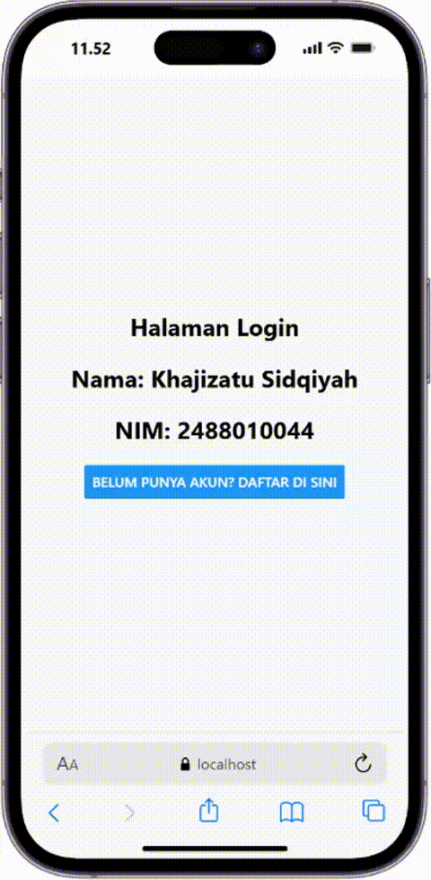
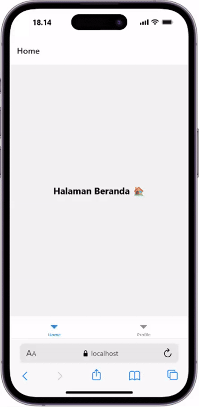
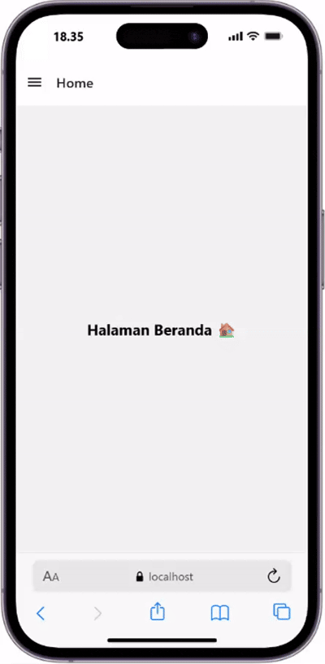

# 📱Laporan praktikum 4: React Native Navigation #

## Tujuan Pembelajaran ##
Mahasiswa mampu:
1. Merancang dan menerapkan navigasi antar layar (screen) pada aplikasi react native
2. menggunakan libary react nativigation (stuck navigator, tab navigator, drawer native)

## Alur Praktikum ##

### Langkah 1: instalasi proyek react native ###
1. buka terminal atau cmd
2. ubah directori ke folder pertemuan 4 (cd "Pemrograman Mobile\Pertemuan4")
3. buat proyek baru menggunakan perintah berikut: 'npx create-expo-app ptmn4 --template blank'
4. masuk ke dalam folder proyek menggunakan perintah berikut : 'cd ptmn4'
5. instal core navigation libarary (npm install @react-navigation/native)
6. instal depedensi pendukung (wajib untuk expo) npx expo install  react-native-screens react-native-safe-area-context react-native-gesture-handler react-native-reanimated

### langkah 2 ###
1. install pustaka stuck : npm install @react-navigation/native-stack
2. buat folder didalam projek dengan nama screens
3. didalam folder screens buat 2 file dengan nama login.js dan sigup.js
4. masukan kode sesuai pada modul praktikum
5. sesuaikan file App.js dengan kode yang ada pada modul
6. simpan dan install depensi untuk web "npx expo install react-dom react-native-web"
7. jalankan perintah npx expo start --web
8. konfirmasi bukti

### langkah 3: Bottom Tab Navigation ###
1. instalasi pustaka buttom tabs: npm install @react-navigation/bottom-tabs
2. buat file HomeScreen.js dan ProfileScreen.js di dalam folder screens
3. Konfigurasi Tab di App.js
4. konfirmasi bukti

### langkah 4: Drawer Navigation ###
1. instalasi pustaka drawer: npm install @react-navigation/drawer
2. konfigurasi drawer di App.js
3. konfirmasi bukti

